The system is built as a modular **FastAPI + ETL + MySQL + MiniIO** architecture designed for institutional-grade equity research workflows.

A structured ETL backbone continuously ingests and normalizes financial data, which is then exposed through API services and consumed by downstream LLM agents, research modules, and portfolio analytics systems.

# Quant Copilot – AI Method Map

## Feature → Method Map

| # | Feature | Method | Phase |
|---|----------|---------|--------|
| 1 | Financial change detection | Pure SQL | v1 |
| 2 | Peer comparison grid | Pure SQL | v1 |
| 3 | PDF section navigator | Document RAG | v1 |
| 4 | Concall structured extractor | Structured extraction | v1 |
| 5 | Concall diff (QvQ) | SQL + Python diff | v1 |
| 6 | Data conflict flag | Pure SQL | v1 |
| 7 | Data freshness indicator | Metadata tracking | v1 |
| 8 | Evidence finder | Multi-doc RAG | v2 |
| 9 | Guidance accuracy tracker | Structured extraction + SQL | v2 |
| 10 | Sector intelligence feed | Agentic pipeline | v2 |
| 11 | Research workspace | Application layer | v2 |
| 12 | Draft section assistant | Agentic + generation | v3 |
| 13 | Shareholding divergence | Pure SQL | v3 |
| 14 | API layer | Engineering only | v3 |

---

## Methods

<details>
<summary><b>Pure SQL / Rule-Based</b> (Features 1,2,5,6,7,13)</summary>

### Purpose

Seven of fourteen features require no AI.

These features are deterministic calculations,
joins, comparisons, and validations.

### Financial Change Detection

```sql
SELECT metric,
       curr_val,
       prev_val,
       (curr_val-prev_val)/prev_val*100 AS pct_delta
FROM screener_quarterly
WHERE ticker='TCS'
ORDER BY period DESC
LIMIT 2;
```

Store results in:

```text
metric_deltas
```

### Data Conflict Flag

Compare:

```text
annual_report_value
vs
screener_value
```

Rule:

```python
abs(doc_val - screener_val) / screener_val > 0.02
```

If true:

```text
Insert conflict record
```

### Why SQL First?

- Uses existing MySQL
- Sub-100ms response times
- Easy to audit
- No AI costs
- No hallucinations

</details>

---

<details>
<summary><b>LLM Structured Extraction</b> (Features 4,9)</summary>

### Purpose

Extract structured facts from documents.

No RAG.

No vector database.

No retrieval.

LLM acts as a parser.

### Example Schema

```python
class ConcallExtract(BaseModel):
    guidance: list[GuidanceItem]
    risks: list[str]
    capex_statements: list[CapexItem]
    hiring_commentary: list[str]
```

### Prompt Rules

- Extract only stated facts
- Do not infer
- Return empty list if absent
- Include source sentence
- Store output once in MySQL

### Recommended Models

- Claude Sonnet
- Claude Haiku

Avoid GPT-3.5 for financial extraction.

</details>

---

<details>
<summary><b>Document RAG</b> (Feature 3)</summary>

### Purpose

Single-document retrieval.

No generation.

Return relevant pages and sections.

### Chunking Strategy

#### Annual Reports

- Chunk by section
- 400–600 tokens
- 100 token overlap

Metadata:

```text
ticker
doc_type
year
section_name
page_start
chunk_text
```

#### Concall Transcripts

Chunk by speaker.

Metadata:

```text
management
analyst
```

### Retrieval

Hybrid Search:

- BM25
- Embeddings
- Reciprocal Rank Fusion

Recommended:

- Qdrant
- pgvector
- rank_bm25

</details>

---

<details>
<summary><b>Multi-Document RAG</b> (Feature 8)</summary>

### Purpose

Cross-document evidence retrieval.

### Pipeline

1. User enters thesis
2. Hybrid retrieval
3. Cross-encoder reranking
4. LLM synthesis
5. Evidence display

### Reranker

```text
cross-encoder/ms-marco-MiniLM-L-6-v2
```

### Critical Rule

Always filter by:

```sql
ticker
year
doc_type
```

before vector search.

</details>

---

<details>
<summary><b>Agentic Pipeline</b> (Features 10,12)</summary>

### Feature 10

Sector Intelligence Feed

Flow:

1. Fetch concall data
2. Cluster themes
3. Generate sector insights
4. Store results

### Feature 12

Draft Assistant

1. Analyst selects insights
2. Retrieve evidence
3. Generate paragraph
4. Add compliance watermark

### Recommendation

Use:

```text
Plain Python
FastAPI Background Tasks
```

Avoid:

- LangChain
- CrewAI
- AutoGPT

for v1.

</details>

---

## What Not To Use

### LLM Fine-Tuning

Skip for now.

Requirements before considering:

- 500+ labeled examples
- Repeated failure pattern
- Prompt engineering exhausted

Focus on:

- Better extraction prompts
- Better chunking
- Better reranking

---

### Full Agent Frameworks

Avoid for v1.

Examples:

- LangChain
- CrewAI
- AutoGPT

Reasons:

- Harder debugging
- Added latency
- Reduced transparency

Use direct SDK integrations instead.
## Architecture

<p align="center">
  
</p>

```text
        FastAPI Backend
               │
               ▼
        Service Layer
               │
               ▼
        ETL Orchestrator
               │
    ┌──────────┼──────────┐
    ▼          ▼          ▼
 Extract    Transform     Load
               │
               ▼
          MySQL Database
               │
               ▼
        Agent / Research Layer
```

### Key Components Extracted from the Codebase Graph

| Layer                          | Modules                                                                                                                                                                                                                           |
| ------------------------------ | --------------------------------------------------------------------------------------------------------------------------------------------------------------------------------------------------------------------------------- |
| **API Layer**                  | `app/main.py`, `api/routes.py`, `services/pipeline_service.py`, `models/schemas.py`                                                                                                                                               |
| **ETL — Extract**              | `balance_sheet_extractor`, `profit_and_loss`, `cash_flow_mysql`, `quarterly_result_mysql`, `growth_metrcis`, `shareholding_mysql`, `stocks_mysql`, `earnings`, `macro_mysql`, `corporate_actions`                                 |
| **ETL — Transform**            | `financials.py`, `normalizer.py`                                                                                                                                                                                                  |
| **ETL — Load**                 | `bs_loader`, `pl_loader`, `cf_loader`, `qr_loader`, `gm_loader`, `sh_loader`, `ca_loader`, `earnings_loader_mysql`, `macro_loader_mysql`, `price_loader_mysql`, `stocks_loader_mysql`, `technical_loader_mysql`, `run_log_loader` |
| **Database Infrastructure**    | `db_mysql`, `init_db_mysql`, `dedup_mysql`, `validator_mysql`, `mysql_schema_v2.sql`                                                                                                                                              |
| **Pipeline Orchestration**     | `etl/mysql_pipeline.py`, `pipeline_service.py`                                                                                                                                                                                    |
| **Architecture Visualization** | `graphify-out/graph.html`, `graphify-out/graph.json`, `GRAPH_REPORT.md`                                                                                                                                                           |
| **Containerization**           | `Dockerfile`, `docker-compose.yml`                                                                                                                                                                                                |

---

## Project Structure

```text
Quant_CoPilot-Equity-Research-Agent/
│
├── app/                                      # FastAPI application layer
│   │
│   ├── main.py                               # FastAPI entry point
│   ├── __init__.py
│   │
│   ├── api/                                  # API route layer
│   │   ├── routes.py                         # REST endpoints
│   │   └── __init__.py
│   │
│   ├── services/                             # Business logic / orchestration
│   │   ├── pipeline_service.py               # Triggers ETL workflows
│   │   └── __init__.py
│   │
│   ├── models/                               # Request/response schemas
│   │   ├── schemas.py
│   │   └── __init__.py
│   │
│   ├── core/                                 # Config, constants, security
│   │
│   └── utils/                                # Shared utility helpers
│
├── etl/                                      # ETL pipeline layer
│   │
│   ├── mysql_pipeline.py                     # Main ETL orchestrator
│   ├── __init__.py
│   │
│   ├── extract/                              # Data extraction modules
│   │   ├── balance_sheet_extractor.py
│   │   ├── profit_and_loss.py
│   │   ├── cash_flow_mysql.py
│   │   ├── quarterly_result_mysql.py
│   │   ├── growth_metrcis.py
│   │   ├── shareholding_mysql.py
│   │   ├── stocks_mysql.py
│   │   ├── earnings.py
│   │   ├── macro_mysql.py
│   │   ├── corporate_actions.py
│   │   └── __init__.py
│   │
│   ├── transform/                            # Data normalization & metrics
│   │   ├── financials.py
│   │   └── normalizer.py
│   │
│   └── load/                                 # Database loading layer
│       ├── bs_loader.py
│       ├── pl_loader.py
│       ├── cf_loader.py
│       ├── qr_loader.py
│       ├── gm_loader.py
│       ├── sh_loader.py
│       ├── ca_loader.py
│       ├── earnings_loader_mysql.py
│       ├── macro_loader_mysql.py
│       ├── price_loader_mysql.py
│       ├── stocks_loader_mysql.py
│       ├── technical_loader_mysql.py
│       ├── run_log_loader.py
│       └── __init__.py
│
├── database/                                 # Database infrastructure
│   ├── db_mysql.py                           # MySQL connection management
│   ├── init_db_mysql.py                      # Schema initialization
│   ├── dedup_mysql.py                        # Deduplication utilities
│   ├── validator_mysql.py                    # Data quality validation
│   ├── mysql_schema_v2.sql                   # Main production schema
│   └── __init__.py
│
├── graphify-out/                             # Architecture dependency graph
│   ├── graph.html
│   ├── graph.json
│   └── GRAPH_REPORT.md
│
├── images/
│   └── quant_copilot_pipeline_diagram.svg
│
├── Dockerfile
├── docker-compose.yml
├── requirements.txt
├── README.md
├── .dockerignore
└── .gitignore
```

---

## Setup

```bash
git clone https://github.com/Import-Saurabh/Quant_CoPilot-Equity-Research-Agent.git

cd Quant_CoPilot-Equity-Research-Agent

python -m venv .venv

# Linux / Mac
source .venv/bin/activate

# Windows
.venv\Scripts\activate

pip install -r requirements.txt

# Initialise MySQL schema
python -m database.init_db_mysql

# Run FastAPI backend
uvicorn app.main:app --reload
```

---

## Tech Stack

| Component             | Technology             |
| --------------------- | ---------------------- |
| Backend API           | FastAPI                |
| Database              | MySQL                  |
| ETL Engine            | Python                 |
| Data Sources          | Screener.in, NSE       |
| Data Processing       | pandas, numpy          |
| Containerization      | Docker, Docker Compose |
| Architecture Analysis | Graphify               |
| Visualization         | Matplotlib, Plotly     |
| LLM Layer             | OpenAI / Anthropic     |
| Future Orchestration  | Apache Airflow         |
